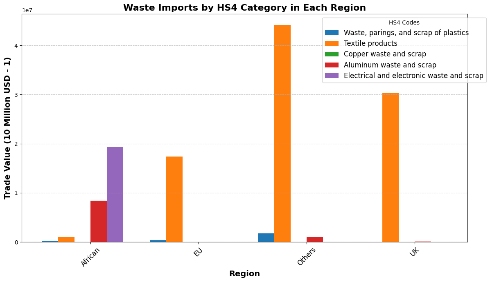
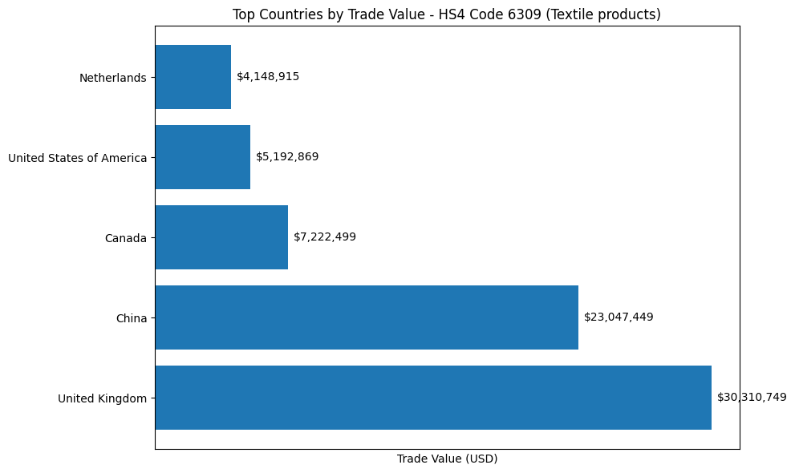
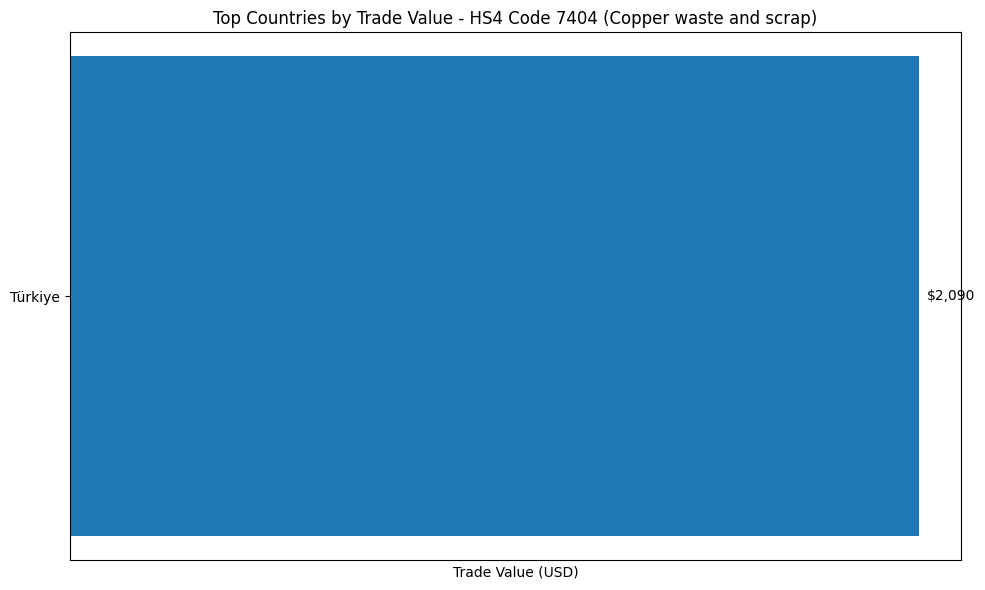
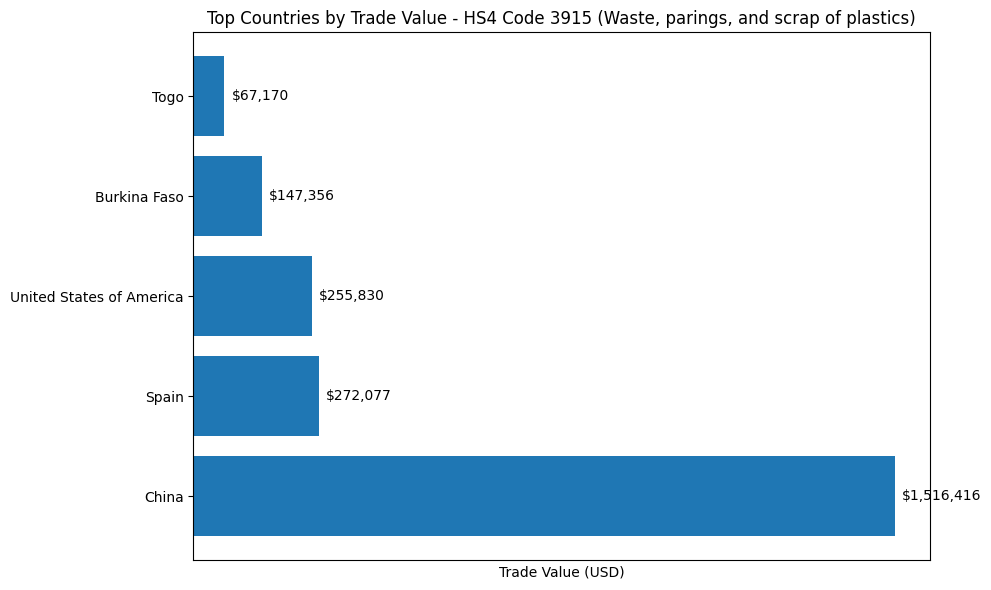
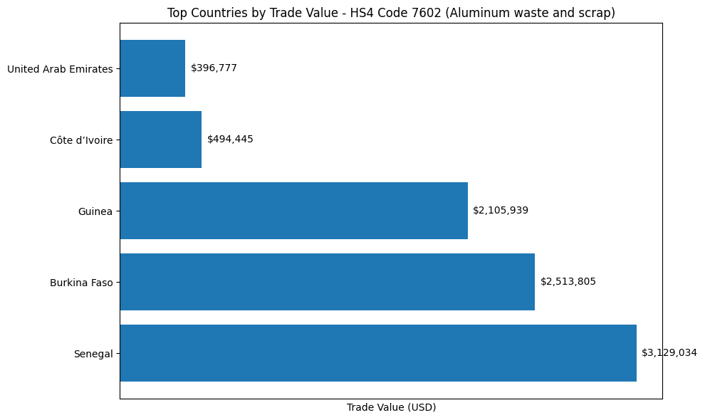
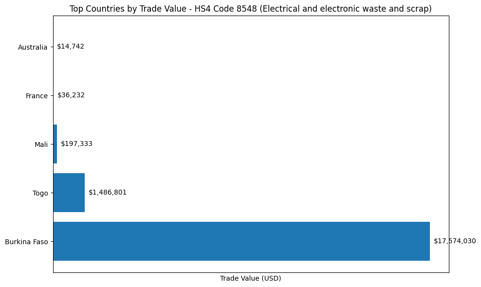

# Ghana Waste Analysis Project

This project aims to analyze waste management practices in Ghana from the perspective of a UK environmentalist organization. It utilizes various datasets to understand the flow of waste.

## Data Sources

1. **Raw Data**
   - `micro_data_trade_2022.csv`: Contains raw trade data for the year 2022, including information on imports and exports relevant to waste management.

2. **Processed Data**
   - `textile_import_data.csv`: Processed data specifically related to textile imports, filtered and cleaned for analysis.

## Installation

To set up the project, clone the repository and install the required dependencies:

```bash
git clone https://github.com/Doctor2007/helium1b.git
cd helium1b
pip install -r requirements.txt
```

## Contributing

Contributions are welcome! Please open an issue or submit a pull request for any improvements or suggestions.


## Notebook
# Data Exploration for Waste Management in Ghana

This notebook is dedicated to exploratory data analysis (EDA) of the import data in Ghana in 2022. The aim is to gain initial insights into the data, identify patterns, and prepare for further analysis.


```python
import pandas as pd
import matplotlib.pyplot as plt
import seaborn as sns
```

## Initial Data Cleaning & Processing

This section outlines the key steps taken to prepare the trade data for analysis:

1. Data cleaning process:
    - Removed missing values and outliers
    - Standardized country name formats
    - Fixed inconsistent units of measurement

2. Data transformation:
    - Created an aggregated dataset by country (`import_by_country`)
    - Assigned geographic regions to each country for regional analysis
    - Calculated summary statistics by region


The processed data provides the foundation for our subsequent exploratory analysis and visualization.

## HS4 Classiffications

1. The code under shows which HS codes where used and what do they represent.

This data is from the raw data set provided by Ghana Statistical Service Microdata Catalog ([link](https://microdata.statsghana.gov.gh/index.php/catalog/121))


```python
from data_processing import hs4_codes
data1 = pd.read_csv('data/raw/micro_data_trade_2022.csv')
waste_codes = hs4_codes()  
waste_descriptions = data1[data1['HS4'].isin(waste_codes)][['HS4', 'Description_HS4']].drop_duplicates().set_index('HS4')

waste_descriptions
```


<div>
<table border="1" class="dataframe">
  <thead>
    <tr style="text-align: right;">
      <th></th>
      <th>Description_HS4</th>
    </tr>
    <tr>
      <th>HS4</th>
      <th></th>
    </tr>
  </thead>
  <tbody>
    <tr>
      <th>6309</th>
      <td>Worn clothing and other worn articles</td>
    </tr>
    <tr>
      <th>7404</th>
      <td>Copper waste and scrap</td>
    </tr>
    <tr>
      <th>3915</th>
      <td>Waste, parings and scrap, of plastics</td>
    </tr>
    <tr>
      <th>7602</th>
      <td>Aluminium waste and scrap</td>
    </tr>
    <tr>
      <th>8548</th>
      <td>Electrical parts of machinery or apparatus, nes</td>
    </tr>
  </tbody>
</table>
</div>


```python
from visualisations import plot_waste_imports
fig, ax = plot_waste_imports()
```


    

    


```python
from top_countries import get_top_countries_by_hs4, plot_top_countries, get_hs4_descriptions

top_countries = get_top_countries_by_hs4()
hs4_descriptions = get_hs4_descriptions()

fig, ax = plot_top_countries(top_countries, 6309, hs4_descriptions=hs4_descriptions)
```


    

    


```python
fig, ax = plot_top_countries(top_countries, 7404, hs4_descriptions=hs4_descriptions)
```


    

    


```python
fig, ax = plot_top_countries(top_countries, 3915, hs4_descriptions=hs4_descriptions)
```


    

    


```python
fig, ax = plot_top_countries(top_countries, 7602, hs4_descriptions=hs4_descriptions)
```


    

    


```python
fig, ax = plot_top_countries(top_countries, 8548, hs4_descriptions=hs4_descriptions)
```


    

    

